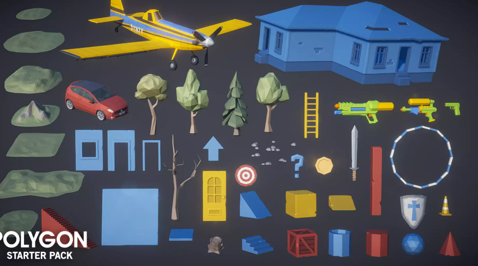
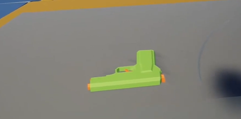
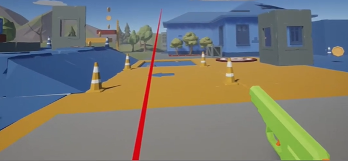

# Projeto de Jogo de Tiro em Realidade Virtual (VR)

## Integrantes
- Anderson Hideki Suzuki
- Pedro Camasmie Kobayashi

## Descrição do Projeto

O projeto teve como base o desenvolvimento de um jogo de tiro em Realidade Virtual (VR), com foco na imersão do jogador em um ambiente 3D interativo. O objetivo é proporcionar uma experiência envolvente em que o usuário possa pegar uma arma virtual e atirar em diferentes tipos de alvos, explorando as possibilidades de interação oferecidas pela realidade virtual.

Na primeira entrega, o foco era permitir que o jogador pegasse a arma e atirasse utilizando os controladores VR. No entanto, surgiram problemas na mecânica de disparo, pois os projéteis não eram detectados corretamente . Apesar disso, foi possível implementar com sucesso o sistema de interação e empunhadura da arma.

Na entrega final, o problema do disparo foi corrigido, permitindo que o jogador finalmente atirasse de forma funcional e responsiva.
Com essa base sólida, o projeto evoluiu para incluir novos desafios, como a criação de alvos móveis que se deslocam pelo cenário, exigindo maior precisão e reflexo do jogador. 

Essas melhorias consolidam o objetivo do projeto: explorar a imersão e o realismo da Realidade Virtual, oferecendo ao jogador uma experiência interativa e divertida.

## Funcionalidades Implementadas

- Interagir com a arma do plano.
- Atirar com o controle do oculus.
- Acertar alvos do cenario.
- Lógica básica de colisão entre o disparo e o alvo .
- Interface simples e interativa com botões funcionais.

---

## Tecnologias e Ferramentas Utilizadas

- **Unity Engine** (versão recomendada: 2024.3.8f1)  
- **XR Interaction** Toolkit (para interação com controladores VR) 
- **OpenXR Plugin**  
- **C#** (linguagem principal para scripts)  
- **TextMesh Pro** (para elementos de UI)  

---

## Instalação e Configuração

1. **Clone o repositório** ou baixe os arquivos do projeto:
   ```bash
   git clone https://github.com/andysuzuki23432/VR_T2.git
   ```
2. **Abra o projeto no Unity Hub**  
   - Certifique-se de usar a mesma versão do Unity usada no desenvolvimento (2024.3.8f1).

3. **Verifique as dependências no Package Manager**:
   - XR Interaction Toolkit  
   - OpenXR Plugin
   - TextMesh Pro  

4. **Build e execução**:
   - Para Oculus:
     - Selecione o modo OpenXR em Project Settings > XR Plug-in Management.
     - Configure o pacote do aplicativo em Player Settings > Other Settings.
     - Conecte seu headset VR (como Meta Quest ou HTC Vive) e clique em Build and Run.

## Imagens DEMO:



